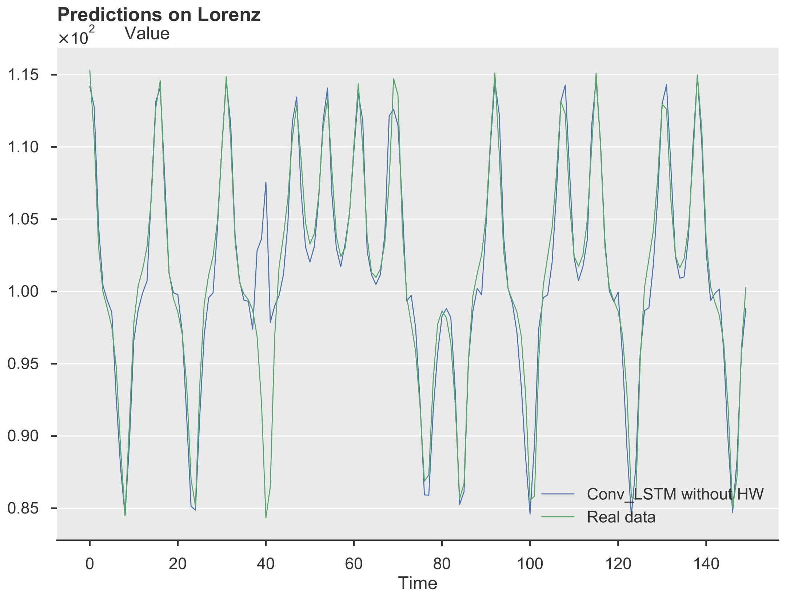
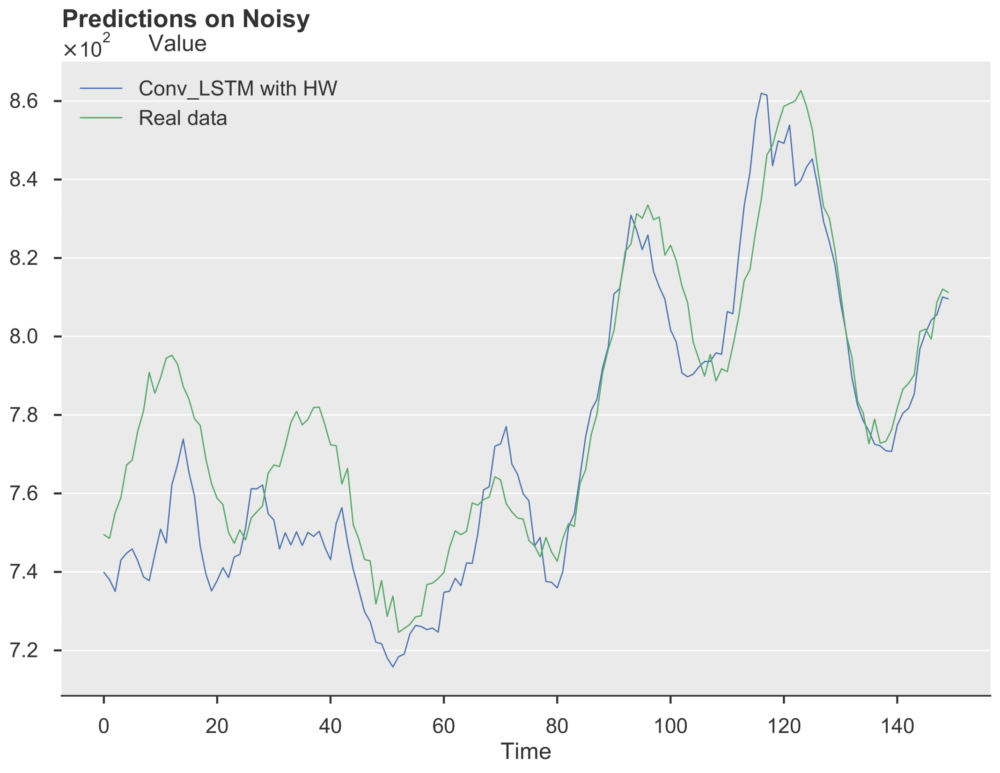

<h1 align="center">
  Imaging Time-Series to improve NN forecasting
</h1>
<p align="center">Alper Karaaslan, Francesco Forcher, Simeone de Fremond, Stefano d'Apolito<br>
In this project we have explored the use of imaging time series to enhance forecasting results with Neural Networks. The approach has revealed itself to be extremely promising as, both in combination with an LSTM architecture and without, it has out-performed the pure LSTM architecture by a solid margin within our test datasets.</p>
<div align="center">
<a href="https://www.python.org/downloads/"></a>
<a href="https://www.gnu.org/licenses/gpl-3.0.en.html"></a>
</div>

## Installation and requirements
* Python 3.6
* Tensorflow 2
* Tensorboard
* Keras
* H5py
* Matplotlib
* Numba
* Numpy
* Pandas
* Pyts
* Scipy & Sklearn
* Tqdm

To install all requirements run:
```
pip install requirements.txt
```
If you run into some issues, make sure that matplotlib is already installed on your machine.

## Usage example
Our models have been implemented for two generated datasets and an additional real life dataset, for which trained models are provided.
The logs, predictions, and model weights can all be found in their appropriate folders in the final_results directory.
### Trend + Seasonality + Noise dataset
To run the training and testing of the model:
```
python script\example_time_series.py --model=model (--hw) (--no_cb)
```
where model can be:
- "Conv_LSTM"
- "Conv_MLP"
- "LSTM" (in this case, the value of hw does not matter)

if --hw is supplied: the chosen model will be combined with Holt-Winter otherwise it will be just pure NN
if --no_cb is supplied: no callbacks will be recorded, only a csv file containing predictions will be recorded at the end

````
Example: python script\example_time_series.py --model="Conv_LSTM" --hw
(Warning:  because of the number of datapoints we train, it may take up to 25Gb of RAM)
````

To only get the results of our experiments run:
````
python script\example_time_series_results.py
````

### Lorenz attractor dataset
To run the training and testing of the model:
```
python script\example_lorenz.py --model=model (--hw) (--no_cb)
```
where model can be:
- "Conv_LSTM"
- "Conv_MLP"
- "LSTM" (in this case, the value of hw does not matter)

if --hw is supplied: the chosen model will be combined with Holt-Winter otherwise it will be just pure NN
if --no_cb is supplied: no callbacks will be recorded, only a csv file containing predictions will be recorded at the end

````
Example: python script\example_lorenz.py --model="Conv_LSTM" --hw
(Warning:  because of the number of datapoints we train, it may take up to 25Gb of RAM)
````

To only get the results of our experiments run:
````
python script\example_lorenz_results.py
````

### Dowjones dataset
To run the training and testing of the model:
```
python script\Dowjones_Executer.py --model=model (--hw) (--no_cb)
```
where model can be:
- "Conv_LSTM"
- "Conv_MLP"
- "LSTM" (in this case, the value of hw does not matter)

if --hw is supplied: the chosen model will be combined with Holt-Winter otherwise it will be just pure NN
if --no_cb is supplied: no callbacks will be recorded, only a csv file containing predictions will be recorded at the end

````
Example: python script\Dowjones_Executer.py --model="Conv_LSTM" --hw
````

To only get the results of our experiments run:
````
python script\dowjones_results.py
````

## Results
Below are some sample results of our generated predictions vs the ground truth. <br> <br>


